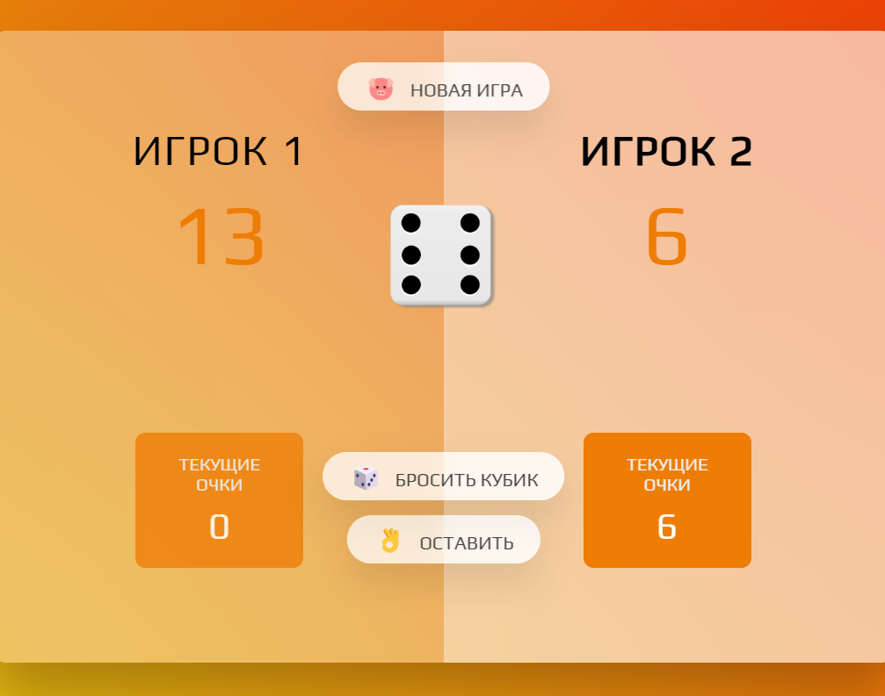

# 1. Guess-the-number

Guess the number - a game in which you need to guess the hidden number in the least number of attempts.

# 2. Modal window

Modal window - In this project, I implemented the logic of the modal window in the "script.js" file

The logic is responsible for the appearance of a modal window when you click on one of the buttons. Change the background when a modal window appears, and the option to close the modal window by clicking on the background behind the window, on the "x" in the window, and closing it with the "Esc" key.

# 3. Game - Pig

This project implements the logic of the old game - Pig in a poke "script.js"

---

I implemented all the logic of the game in the "script.js" files as part of the "DOM Manipulation" module of the course "Modern JavaScript - from Zero to Junior Specialist"
