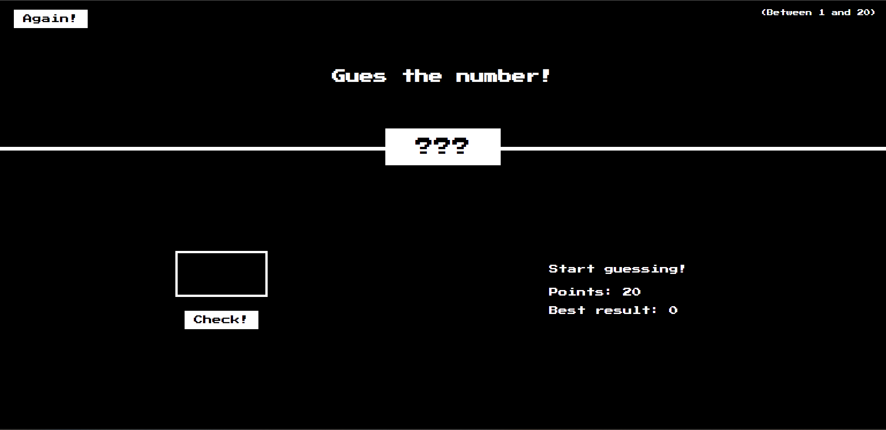

# Guess-the-number
Guess the number - a game in which you need to guess the hidden number in the least number of attempts.

I implemented all the logic of the game in the "script.js" file as part of the "DOM Manipulation" module of the course "Modern JavaScript - from Zero to Junior Specialist"

[Demo](https://acerpo.github.io/Guess-the-number/)

